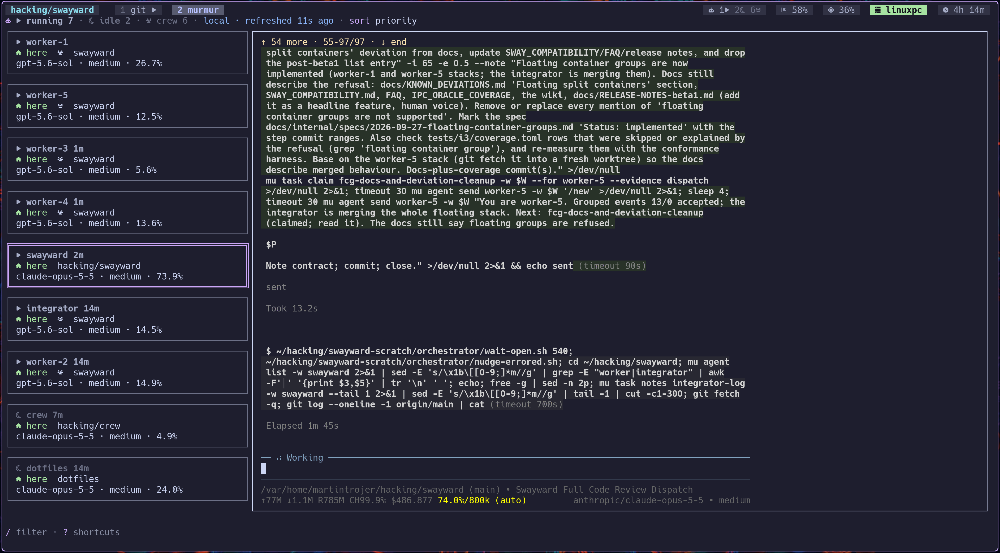

# murmur

**A tmux HUD for every coding agent you have running, on every machine.**

murmur is two layers. Underneath is a small state protocol: each machine
records what its own agents are doing, and peers pull each other's complete
snapshots over ssh. On top are tmux HUDs that read the merged list: a status
bar segment, a picker, a dashboard, and a side panel.



One agent is blocked waiting on you. Which machine is it on? murmur answers
that and jumps you there. From the dashboard you can also prompt or stop the
agent over ssh without leaving it.

## Surfaces

| Command | Job |
| --- | --- |
| `murmur status` | Attention-state rollups plus the total crew count for a tmux status bar |
| `murmur pick` | fzf jump list — type to narrow, enter jumps, `ctrl-a` / `--all` toggles crew |
| `murmur dash` | Full-screen dashboard: watch, prompt, and stop local or remote agents |
| `murmur sidepanel` | Compact agent list in a full-height pane beside the current tmux window |

All four read the same list. Local jump is a window switch; remote jump opens
over ssh (or your `--jump-command`). Orchestrated (`crew`) agents stay hidden
from state rollups unless they are `blocked`, `error` or `crashed`, because their
supervisor consumes anything else. `murmur status` also emits their total as a
separate `crew` record, including those urgent agents.

murmur can also notify you: an executable `~/.config/murmur/on-attention` runs
once per new `done`, `blocked`, `error` or `crashed`, on any node. See
[notifications](docs/setup.md#notifications).

`murmur dash` wants a [Nerd Font](https://www.nerdfonts.com/) and a Catppuccin
Mocha terminal. Press `?` for its shortcut panel. `/` filters cards by agent,
workstream, session, host, or state; `c` toggles compact one-line rows. Press
`i` to compose a prompt for the selected local or remote agent; opening it
clears the agent's done/blocked mark, as focusing its pane would. In input mode,
enter sends, `ctrl-e` stops the agent, and escape returns to the dashboard.
`s` **node** sort is local cards first, then remotes A–Z.

`murmur sidepanel` shows the same local and remote agents, with the dashboard's
saved sort and visibility preferences. Press `?` for all keys. Press `a` to
toggle crew agents and `c` to toggle compact one-line rows. Both settings are
shared with the dashboard. Press `j` or `k` to move, `g` or `G` to jump to an
edge, and enter to jump to the selected agent. Click selects, double-click jumps, and
the wheel moves the selection. A successful jump closes the
panel; a failed jump leaves it open and shows the error. Press `q` or `Ctrl-C`
to close it. See [side panel setup](docs/setup.md#side-panel).

## How it compares

murmur now overlaps with [herdr](https://github.com/herdrdev/herdr) and
[workmux](https://github.com/raine/workmux) on the HUD side: all three show
agent state in a sidebar or dashboard. The difference is where the state comes
from and what each tool owns.

| | murmur | herdr | workmux | [mu](https://github.com/mu-crew/mu) |
| --- | --- | --- | --- | --- |
| Primary job | Agent-state HUD over tmux | Terminal runtime for agents | Git worktree + tmux window workflow | Task DAG control plane for an agent crew |
| Owns the terminals | No; reads your tmux | Yes; its server owns the panes | No; drives tmux (or zellij, kitty, WezTerm) | No; spawns agents into tmux or herdr panes |
| Across machines | Yes; peers exchange state snapshots over ssh | One host at a time; attach remotely with `herdr --remote` | One host | One orchestrator; remote agents run over ssh commands |
| Git worktrees | No | Yes (`herdr worktree`) | Yes, its core feature | Per-agent VCS workspaces |
| Places work | No | Agents drive panes through its CLI and socket API | Delegates tasks to worktree agents | Yes; typed task DAG with claims |
| Agent HUD | Status segment, picker, dashboard, side panel | Built-in agent sidebar | Dashboard, sidebar, window-name status | Crew and task dashboard |

They combine. murmur sees any pi agent running in a tmux pane, including the
panes workmux creates and the agents mu spawns; mu marks its agents as crew.
murmur needs tmux, so agents inside herdr's own panes are not visible to it.

## Install

Needs tmux, [pi](https://github.com/earendil-works/pi), `fzf`, and
Node 20+. Multi-machine: ssh access, murmur on each node.

On every node that runs agents:

```bash
npm install -g @mu-crew/murmur
murmur init      # this node's identity
murmur link pi   # install the agent-side extension
```

Agents must run **inside tmux**. A tmux server plus pane id is the address;
without one there is nothing to jump to. Remote agents need tmux on the remote
too — the jump uses
`ssh -t <host> env LC_CTYPE=C.UTF-8 tmux attach` unless you override it.

Add focus hooks so looking at a finished agent clears its badge — see
[docs/setup.md](docs/setup.md#tmux-focus-hooks). Wire Codex / Cursor /
opencode notify hooks in the same file.

`PREFIX G` toggles the dash from anywhere. It switches to the running dash, or
opens one in a `murmur-dash` session. Pressed in the dash, it takes you back to
where you were. In a murmur-controlled remote session it leaves, so the local
client comes back on its own. See
[docs/setup.md](docs/setup.md#one-key-to-the-dash-and-back).

### Watch more than one machine

```bash
murmur peer add devbox
murmur doctor            # is peering mutual?
bind -N "agent state picker" a display-popup -E -w 80% -h 60% "murmur pick"
bind -N "toggle murmur dash" G run-shell -b "murmur dash --goto"
bind -N "agent side panel" C-m run-shell "murmur sidepanel"
```

Peering is one-way until both sides add each other. Hard ssh cases (second
factor / `BatchMode`, `MaxSessions 1`, Eternal Terminal): [SSH.md](SSH.md).

## What it is / is not

- **Is:** a state protocol plus tmux HUDs. State is reported from inside the
  agent and pulled peer-to-peer over ssh. No daemon. Current snapshot only; a
  peer answer is replaced whole, and absence means absence. Nothing murmur
  stores or sends is read out of a terminal; the one exception is cosmetic, and
  the dashboard labels it: for an agent that reports no model or context, the
  selected card falls back to summarising that pane's own output.
- **Is not:** a multiplexer or terminal runtime (herdr), a worktree manager
  (workmux), an orchestrator (mu places work), or a remote terminal.

## Docs

| Doc | For |
| --- | --- |
| [docs/setup.md](docs/setup.md) | Hooks, side panel, harness notify, notifications, peers, doctor, jump |
| [SSH.md](SSH.md) | Auth, session caps, control masters |
| [ARCHITECTURE.md](ARCHITECTURE.md) | Model, design choices, gaps |
| [docs/VOCABULARY.md](docs/VOCABULARY.md) | Protocol and identity terms |
| [AGENTS.md](AGENTS.md) | Repo gate for agents working on murmur |

**1.0.3.** Ready for daily use. Known gaps live at the end of
[ARCHITECTURE.md](ARCHITECTURE.md#known-gaps).

---

Part of [mu-crew](https://github.com/mu-crew). Written mostly by AI coding agents, with a human reviewing what ships, and built for running them.
